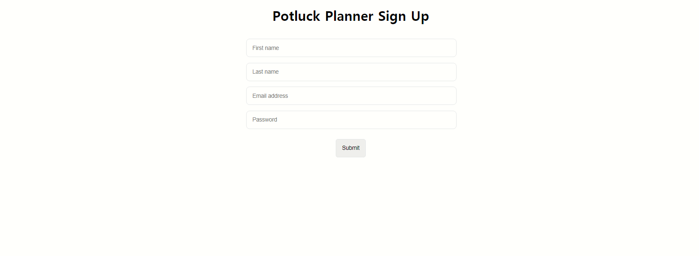

# Front-End

| Resource | Link | Note |
|-|-|-|
| Trello | [trello-board](https://trello.com/b/JN4HNaJX/kanban-template) |  |
| Gitbook Notes | [git-book](https://app.gitbook.com/@bryan-guner/s/potluck-planner/~/settings/integrations) | Where I keep personal notes... feel free to use it too |
| Github Orginization | [potluck github org](https://github.com/FT-Potluck-Planner-5) |  |
| Experiment/documentation Repo | [experimental](https://github.com/FT-Potluck-Planner-5/Resources-Orginization-Experiment-Sandbox) |  |
| Slack Channel | [slack](https://lambda-students.slack.com/archives/C022PB42GKU) |  |
| Build Week Instructions | [notion build week](https://www.notion.so/Git-for-Build-Sprint-20ce2d09dc0e47b1af5d51821b54b810) |  |
| Backend Wiki | [backend](https://github.com/FT-Potluck-Planner-5/Resources-Orginization-Experiment-Sandbox/blob/main/BACKEND-WIKI.md) |  |
| Front End Wiki | [Frontend](https://github.com/FT-Potluck-Planner-5/Resources-Orginization-Experiment-Sandbox/blob/main/FRONTEND-WIKI.md) |  |
| Landing Page So Far  | [landing](https://potluck-planner-landing.netlify.app/)  | I need a short bio for everyone |
| Questions Board  | [q&a](https://github.com/FT-Potluck-Planner-5/Resources-Orginization-Experiment-Sandbox/blob/main/questions.md)| A place to record our questions |
| Resource Links  | [Links](https://github.com/FT-Potluck-Planner-5/Resources-Orginization-Experiment-Sandbox/blob/main/Resource-Links.md)|Post links to potentially useful packages and resources ...etc.. |
  
  
  
  

---
---

# Build Week Student Guide (Full-time)

### The Essentials

---

[Full Time Schedule and Milestones](https://www.notion.so/c53bc03f390842b6a8a72b26956a48f4)

[Build Week Rubrics & Role Descriptions ](https://www.notion.so/Build-Week-Rubrics-Role-Descriptions-2f62fa64913b4cfe9861865dd7b47833)

[Git for Build Sprint](https://www.notion.so/Git-for-Build-Sprint-98bbbc0113cf4efda6b63a9416900379)

### Getting Set Up

---

[How to set up Trello board for Build Weeks](https://www.notion.so/How-to-set-up-Trello-board-for-Build-Weeks-4688651060a44ae4ae5100c7b25c96cc)

- If you're new to Trello, [here's a basic guide to using it.](https://trello.com/en-US/guide/trello-101)

[How to setup Github Organization for Build Weeks](https://www.notion.so/How-to-setup-Github-Organization-for-Build-Weeks-a863ec588d7c440a886547e037a5f9c9)

[Web & DS Scaffolding](https://www.notion.so/Web-DS-Scaffolding-946b8ced1aae4f19aa0fc66006ca3495)

### Planning Your Project as a Team

---

[Product Vision Document](https://www.notion.so/Product-Vision-Document-06ed217577004381908ec9b46c8218a6)

[Product Vision Document (example)](https://www.notion.so/Product-Vision-Document-example-5efed83c7c0a44aebca3020261017bc3)

### What's New in Build Week Since You Were Here Last

---

[FT Build Week Change Log](https://www.notion.so/80e952b7e29840c8a31bd19a1d566e71)

### Peer Reviews

---

[Peer Reviews in Build Week](https://www.notion.so/Peer-Reviews-in-Build-Week-7b5e56af022d4e549249f5972cb9748f)

### Product Information

---

[FT Build Week Product Catalog](https://www.notion.so/FT-Build-Week-Product-Catalog-b48b9a4bd72b434c888c6894589520c4)

### Front End Marketing Pages

---

Find your product here: [https://github.com/LambdaSchoolBuildWeeks/Unit1Marketing](https://github.com/LambdaSchoolBuildWeeks/Unit1Marketing)

---
---

# Potluck Planner

## ☝️ **Pitch**

If you have ever tried to organize a potluck through text messages, online to-do lists or spreadsheets, you'll understand why this app is essential. 

In the world of social gatherings and potlucks the "Potluck Planner" is king. This is your place for all things pot luck.

## ✅  **MVP**

1. As an `organizer` I can create an upcoming `potluck` and invite my friends to attend

2. As an `organizer` I can adjust `date`s, `time`s and `location`s of the potluck

3. As an `organizer` I can use the list feature in my app to add food `items` that we'd like to see at the potluck

4. As a `guest` to a potluck I want to be able to confirm that I'm going to the upcoming `event`

5. As a `guest` I'd like to be able to select which `item`s I'd like to be responsible for bringing

**NOTE: All of the user stories above should only require a single user type. Users can create "potlucks" and add other users to them.**

## 🏃‍♀️ **Stretch**

1. Add a reminders functionality that allows users to link up their upcoming `date`s to their Google calendar.

2. Ability to upload multiple `photos` from the potluck gathering, like a photo gallery for a past event.
